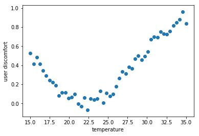
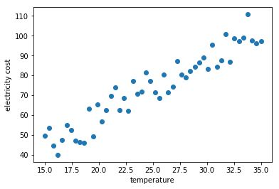
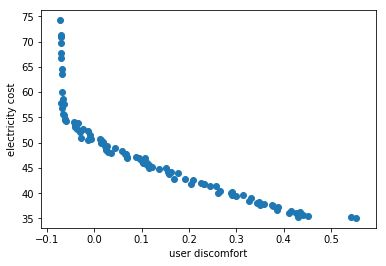

# moo
Multi-objective Optimization of room temperature and electricity

## Introduction
In the current era, demand and usage of electricity is increasing rapidly. Electricity generation
from burning fuels affects the environment in drastic ways such as global warming. Also,
with creation of smart homes, more and more users would like to optimize the electricity
consumption of their smart-house appliances to make it adjusted to the their budget. To
handle these problems, electricity usage can be minimized, and it can be controlled by
optimal consumption of energy. In this paper, we propose a method to optimize the energy
consumption and user comfort in a smart home by using multiobjective optimization
techniques such as Pareto frontier and differential evolution.

## Problem Formulation

### Decision Variables
dv = { t }
t: temperature of the house

### Constraints
These two constraint are explained as below:
Satisfaction constraints: User satisfaction is formed in the range of (0,1)
0 < = s < = 1 *Maximum comfort is at the point 0
Affordable electricity cost is between 0 to 100 euros
0 < = e < = 1 00Objective Functions
1. Maximize satisfaction:
f1 = 1/(√2*π*σ2)*(e(x−a)2/(2*σ 2 )) + random[-0.005,0.005]
σ : sigma = 6
π : pi
a : mean = 22
Based on the recherche, the most comfortable temperature in the room is 20 C.
Thus, users feel most comfortable and highest satisfaction is at 20 C.
In order to apply this problem, we take into account the following:

1. Maximize (Satisfaction) = Minimize [ 1 - f(1) ]

2. Minimize electricity consumption:
f2 = 60/20 * x + random[-10,10], with x > 0 and f2 > 0 otherwise f2 = 0

The average cost of electric bill in France is: 60 euros/month
The most comfortable room temperature : 20 degrees.

## Solution
Three possible solution from our application will be presented. Based on the users’ demand,
they are the decision - makers to choice the solution which suites the best their preferences​ .

Solution is printed in format of a set of solutions
[min of function f1, min of function f2]
[0.5537016647930569, 35.12274525448065]
[0.2612591331566021, 40.0742189619873]
[0.3267824421435541, 38.52630615925331]
[0.24375416429250485, 41.48238045095929]
[0.3860360847879255, 36.68097564390087]
[0.13753504242987258, 44.842709447862]
[0.29980479357903456, 39.49878590087193]
[0.3772768303254973, 37.459776744623284]
[0.4108289093929629, 36.0389985709181]
[0.06435690141729034, 47.67345142030618]
[0.3495341252557873, 37.626007471409885]
[0.4512530939549406, 35.39381366747184]
...

## Install the library
You will need python 3 running in your computer.
To verify, use : python --version
If not, you can install anaconda by download the package as your environment(MAC,
Linux..) and install by accepting the default feature.
Install the library platypus via anaconda, in command line
`conda config --add channels conda-forge`
`conda install platypus-opt`

## Running the Program
Using a console, run the following command from the root directory of the project:
`$ python run.sh`
Upon successful run of the command, you should be able to read the output in the console in
form of pareto solutions as well as the graph showing all the solutions and the Pareto frontier.
